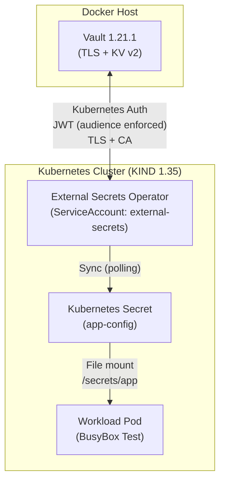

# Vault + External Secrets Operator (ESO) – Kubernetes Lab

This repository demonstrates a **secure, production-accurate integration** between:

- **HashiCorp Vault 1.21.1** (TLS enabled, KV v2)
- **External Secrets Operator (ESO)**
- **Kubernetes 1.35 (KIND)**
- **Vault Kubernetes Auth** using **projected ServiceAccount tokens**
- **File-mounted secrets with live rotation**

The lab intentionally mirrors real-world constraints:
- Strict TLS with a custom CA
- Read-only Vault policies
- Mandatory JWT audience enforcement (Vault ≥ 1.21)
- No dev mode, no disabled validations, no hard-coded tokens

---

## Architecture Overview

### Mermaid Diagram


--- 

#### Important:
External Secrets Operator authenticates to Vault on behalf of workloads.
Application pods never communicate with Vault directly.

## Repository Structure
```
vault-eso-kubernetes-lab/
├── README.md
├── vault/
│   ├── docker-compose.yaml
│   ├── config/
│   │   └──vault.hcl
│   ├── policies/
│   │   └── app-policy.hcl
│   ├── tls/
│   │   └──vault-openssl.cnf
│   └── README.md                # (Vault deep-dive, optional but recommended)
├── kubernetes/
│   ├── eso/
│   │   ├── install.md
│   │   ├── clusterSecretStore.yaml
│   │   └── externalSecret.yaml
│   ├── workloads/
│   │   └── busybox-secret-test.yaml
│   └── rbac/
│       └── vault-auth-delegator.yaml
├── troubleshooting/
│   └── troubleshooting.md
└── .gitignore
```

--- 

## Prerequisites
- Docker
- KIND
- kubectl
- Helm
- Vault CLI
- Kubernetes 1.35+
- Vault 1.21.1+

## Install Vault with Docker Compose
```bash
cd vault
docker compose up -d
```

### Verify Vault is running
```bash
docker ps
```

### Vault should be listening on:
```
https://localhost:8200
```

### From inside Kubernetes, Vault is accessed via:
```
https://host.docker.internal:8200
```

## Installing External Secrets Operator (ESO)

External Secrets Operator is installed using Helm in a dedicated namespace.

### Add the Helm repository

```bash
helm repo add external-secrets https://charts.external-secrets.io
helm repo update
```

### Install ESO
```bash
helm install external-secrets external-secrets/external-secrets \
  --namespace external-secrets \
  --create-namespace
```

### Verify installation
```bash
kubectl get pods -n external-secrets
```

## Troubleshooting

If you encounter issues with Vault authentication, TLS, or ESO secret sync
(e.g. `403 permission denied`, `invalid audience`, or `ClusterSecretStore` not ready),
see the detailed troubleshooting guide:

➡️ [`troubleshooting/troubleshooting.md`](troubleshooting/troubleshooting.md)

## Vault Setup (Summary)
- Vault runs in Docker with TLS enabled
- KV v2 enabled at mount path `kv`
- Kubernetes auth is enabled
- A read-only policy is created for application secrets
- A Kubernetes auth role is configured for External Secrets Operator
- Secret stored at:
```kv/app/config```

Detailed Vault setup (TLS generation, auth configuration, roles and policies)
is documented in the `vault/` directory.

### Vault Policy (KV v2 aware)
````
path "kv/data/app/*" {
  capabilities = ["read"]
}


path "kv/metadata/app/*" {
  capabilities = ["read", "list"]
}
````

#### Note:
- KV v2 policies must reference kv/data/..., not kv/app/....

## Kubernetes Auth – Vault ≥ 1.21 Requirement

Projected ServiceAccount tokens include an audience:
```
"aud": ["https://kubernetes.default.svc.cluster.local"]
```


**Vault 1.21+ enforces exact audience matching.**

The Kubernetes auth role must include:
````
audience = "https://kubernetes.default.svc.cluster.local"
````

Otherwise authentication fails with:
```
403 invalid audience (aud) claim
```

## External Secrets Operator Configuration
```yaml
### ClusterSecretStore (Vault backend)
provider:
  vault:
    server: https://host.docker.internal:8200
    path: kv
    version: v2
    caBundle: <base64-encoded CA cert>
    auth:
      kubernetes:
        mountPath: kubernetes
        role: eso-role

### ExternalSecret
apiVersion: external-secrets.io/v1
kind: ExternalSecret
metadata:
  name: app-config
  namespace: default
spec:
  refreshInterval: 5m
  refreshPolicy: OnChange
  secretStoreRef:
    name: vault-backend
    kind: ClusterSecretStore
  target:
    name: app-config
    creationPolicy: Owner
  data:
    - secretKey: username
      remoteRef:
        key: app/config
        property: username
    - secretKey: password
      remoteRef:
        key: app/config
        property: password
```

Why **refreshInterval** is required:
- Vault does not emit change events. ESO must poll Vault to detect updates.

## Consuming the Secret (File Mount – Correct Pattern)
```yaml
apiVersion: v1
kind: Pod
metadata:
  name: busybox-secret-test
spec:
  containers:
    - name: busybox
      image: busybox:1.36
      command: ["sh", "-c", "sleep 3600"]
      volumeMounts:
        - name: app-config
          mountPath: /secrets/app
          readOnly: true
  volumes:
    - name: app-config
      secret:
        secretName: app-config
```

Inside the pod:
````
cat /secrets/app/username
cat /secrets/app/password
````

## Secret Rotation (End-to-End)
1. Update secret in Vault:
```vault kv patch kv/app/config password="new-value"```
2. Wait for ESO refresh interval
3. Re-read the file without restarting the pod:
```
cat /secrets/app/password
```

The file updates automatically.

## Common Pitfalls
### Audience mismatch

Always decode the JWT:
````
cut -d. -f2 token | base64 --decode | jq .aud
````
### KV v2 policy paths

- Use kv/data/...
- not kv/app/....

### Role vs Policy
- Role = who authenticates (ESO)
- Policy = what is allowed (application secrets)

### Environment variables
- Environment variables do not rotate.
- Use file mounts for secrets that change.

## Git Hygiene
Sensitive material is intentionally excluded:
````
*.key
*.crt
*.pem
*.jwt
.vault-token
````
TLS certificates and tokens are generated locally and must never be committed.

## Final Notes

This lab reflects real production constraints and can be used as:
- A reference implementation
- An onboarding lab
- A troubleshooting guide for Vault + ESO